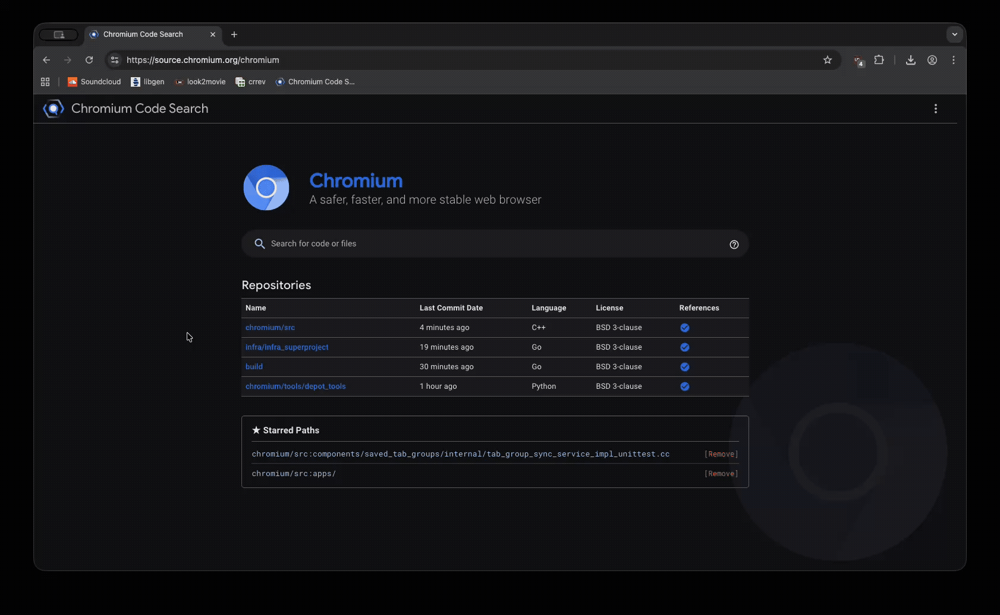

# Chromium Code Search Star

This Chrome extension allows you to star files and folders through the Chromium Code Search UI. Starred paths will appear on their project page (e.g., [Chromium project](https://source.chromium.org/chromium)).

